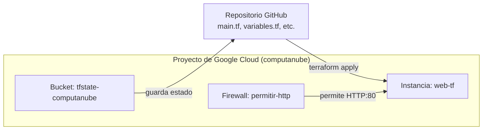

# ComputacionNube
#### 1. Diagrama del sistema (Mermaid)

#### 2. Sección de Evidencias
https://docs.google.com/document/d/1K21Kq6cLSgtJfI-4aECH-AOO6LsssKi9-Zay76BGVhM/edit?usp=sharing

#### 3. Tabla de tiempos (Fase 5)
| Cómo | Tiempo | Qué queda después |
|---|---:|---|
| Interfaz gráfica (Práctica 1, fase 1) | 30 min | Nada. Ni siquiera la lista de clics. |
| `gcloud` (Práctica 1, fase 5) | 24.213 ms | Un comando en el historial, si no se borra. |
| Terraform (hoy) | 19.259 ms | Un repositorio que cualquiera puede clonar, leer y volver a ejecutar, con el historial de cómo llegó a ser lo que es. |

#### 4. Respuestas a las 3 Preguntas de Análisis
Responde brevemente a lo siguiente en tu informe[cite: 1]:

1. **Si en lugar de una etiqueta se hubiera creado manualmente una máquina `web-manual` en la Fase 3, ¿qué habría propuesto `terraform plan` y qué habría hecho `terraform destroy`?**

   Si en vez de una etiqueta se hubiera creado a mano una máquina nueva (web-manual), terraform plan no habría propuesto nada respecto a ella, porque nunca quedó declarada en mi main.tf ni registrada en el estado. Terraform no compara su código contra "todo lo que existe en la nube", sino contra lo que él mismo tiene anotado en el archivo de estado; si un recurso no está ahí, es como si no existiera para efectos de plan. Por la misma razón, terraform destroy tampoco la habría tocado: destroy borra únicamente lo que aparece en el estado, y web-manual nunca entró ahí. Esto me deja claro que el estado, y no la realidad del proyecto de GCP, es lo que define qué administra Terraform.

2. **¿Por qué el bucket del estado se creó con `gcloud` y no en `main.tf`? ¿Qué pasaría al ejecutar `terraform destroy` si estuviera ahí?**
   El problema es que el bucket estaría guardando el archivo que describe su propia existencia: el .tfstate le dice a Terraform qué recursos administra, y si el bucket fuera uno de esos recursos, estaría intentando controlar el lugar donde vive su propio control. Si alguien corriera terraform destroy con el bucket declarado en main.tf, Terraform llegaría en algún punto del proceso a intentar borrar el bucket mientras todavía necesita escribir en él el resultado del propio destroy. Eso podría fallar porque el bucket no estaría vacío en ese instante, o peor, podría borrarlo y perder el registro de que la operación terminó bien, dejando el estado inconsistente. Por eso el bucket se crea aparte con gcloud: necesita existir antes de que Terraform tenga dónde guardar algo, y sobrevivir después de cualquier destroy.

3. **Cálculo de costos y conservación del bucket:**
- Costo mensual estimado de una instancia e2-micro (24/7):
Una instancia e2-micro en la región us-central1 encendida las 730 horas del mes cuesta aproximadamente $7.11 USD/mes (sin contar el disco).

- Costo por haberla usado solo unas horas hoy:
El precio por hora de una e2-micro es de aproximadamente $0.0097 USD/hora (menos de 1 centavo de dólar por hora)

- Costo del bucket de Cloud Storage y motivo de conservación:
El almacenamiento estándar en Cloud Storage en us-central1 cuesta $0.02 USD por GB/mes
